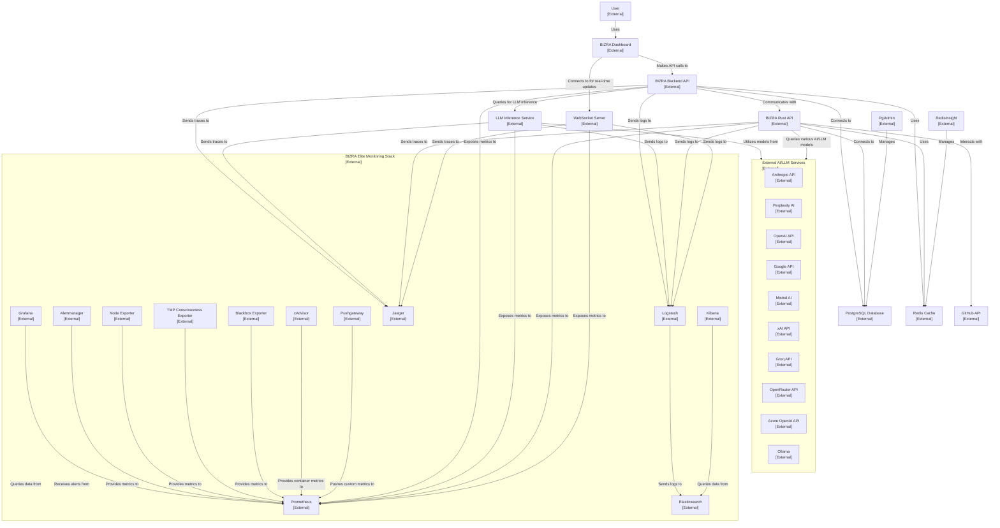

# Unnamed CodeViz Diagram

```mermaid
graph TD

    base.cv::user["User<br>[External]"]
    base.cv::dashboard["BIZRA Dashboard<br>[External]"]
    base.cv::backend["BIZRA Backend API<br>[External]"]
    base.cv::llm_inference["LLM Inference Service<br>[External]"]
    base.cv::rust_api["BIZRA Rust API<br>[External]"]
    base.cv::websocket_server["WebSocket Server<br>[External]"]
    base.cv::postgres["PostgreSQL Database<br>[External]"]
    base.cv::redis["Redis Cache<br>[External]"]
    base.cv::pgadmin["PgAdmin<br>[External]"]
    base.cv::redis_insight["RedisInsight<br>[External]"]
    base.cv::github_api["GitHub API<br>[External]"]
    subgraph base.cv::ai_llm_services["External AI/LLM Services<br>[External]"]
        base.cv::anthropic_api["Anthropic API<br>[External]"]
        base.cv::perplexity_ai["Perplexity AI<br>[External]"]
        base.cv::openai_api["OpenAI API<br>[External]"]
        base.cv::google_api["Google API<br>[External]"]
        base.cv::mistral_ai["Mistral AI<br>[External]"]
        base.cv::xai_api["xAI API<br>[External]"]
        base.cv::groq_api["Groq API<br>[External]"]
        base.cv::openrouter_api["OpenRouter API<br>[External]"]
        base.cv::azure_openai_api["Azure OpenAI API<br>[External]"]
        base.cv::ollama["Ollama<br>[External]"]
    end
    subgraph base.cv::elite_monitoring_stack["BIZRA Elite Monitoring Stack<br>[External]"]
        base.cv::prometheus["Prometheus<br>[External]"]
        base.cv::grafana["Grafana<br>[External]"]
        base.cv::node_exporter["Node Exporter<br>[External]"]
        base.cv::tmp_exporter["TMP Consciousness Exporter<br>[External]"]
        base.cv::blackbox_exporter["Blackbox Exporter<br>[External]"]
        base.cv::alertmanager["Alertmanager<br>[External]"]
        base.cv::elasticsearch["Elasticsearch<br>[External]"]
        base.cv::logstash["Logstash<br>[External]"]
        base.cv::kibana["Kibana<br>[External]"]
        base.cv::jaeger["Jaeger<br>[External]"]
        base.cv::cadvisor["cAdvisor<br>[External]"]
        base.cv::pushgateway["Pushgateway<br>[External]"]
        %% Edges at this level (grouped by source)
        base.cv::grafana["Grafana<br>[External]"] -->|"Queries data from"| base.cv::prometheus["Prometheus<br>[External]"]
        base.cv::alertmanager["Alertmanager<br>[External]"] -->|"Receives alerts from"| base.cv::prometheus["Prometheus<br>[External]"]
        base.cv::logstash["Logstash<br>[External]"] -->|"Sends logs to"| base.cv::elasticsearch["Elasticsearch<br>[External]"]
        base.cv::kibana["Kibana<br>[External]"] -->|"Queries data from"| base.cv::elasticsearch["Elasticsearch<br>[External]"]
        base.cv::node_exporter["Node Exporter<br>[External]"] -->|"Provides metrics to"| base.cv::prometheus["Prometheus<br>[External]"]
        base.cv::tmp_exporter["TMP Consciousness Exporter<br>[External]"] -->|"Provides metrics to"| base.cv::prometheus["Prometheus<br>[External]"]
        base.cv::blackbox_exporter["Blackbox Exporter<br>[External]"] -->|"Provides metrics to"| base.cv::prometheus["Prometheus<br>[External]"]
        base.cv::cadvisor["cAdvisor<br>[External]"] -->|"Provides container metrics to"| base.cv::prometheus["Prometheus<br>[External]"]
        base.cv::pushgateway["Pushgateway<br>[External]"] -->|"Pushes custom metrics to"| base.cv::prometheus["Prometheus<br>[External]"]
    end
    %% Edges at this level (grouped by source)
    base.cv::user["User<br>[External]"] -->|"Uses"| base.cv::dashboard["BIZRA Dashboard<br>[External]"]
    base.cv::dashboard["BIZRA Dashboard<br>[External]"] -->|"Makes API calls to"| base.cv::backend["BIZRA Backend API<br>[External]"]
    base.cv::dashboard["BIZRA Dashboard<br>[External]"] -->|"Connects to for real-time updates"| base.cv::websocket_server["WebSocket Server<br>[External]"]
    base.cv::backend["BIZRA Backend API<br>[External]"] -->|"Queries for LLM inference"| base.cv::llm_inference["LLM Inference Service<br>[External]"]
    base.cv::backend["BIZRA Backend API<br>[External]"] -->|"Communicates with"| base.cv::rust_api["BIZRA Rust API<br>[External]"]
    base.cv::backend["BIZRA Backend API<br>[External]"] -->|"Connects to"| base.cv::postgres["PostgreSQL Database<br>[External]"]
    base.cv::backend["BIZRA Backend API<br>[External]"] -->|"Uses"| base.cv::redis["Redis Cache<br>[External]"]
    base.cv::backend["BIZRA Backend API<br>[External]"] -->|"Sends traces to"| base.cv::jaeger["Jaeger<br>[External]"]
    base.cv::backend["BIZRA Backend API<br>[External]"] -->|"Sends logs to"| base.cv::logstash["Logstash<br>[External]"]
    base.cv::backend["BIZRA Backend API<br>[External]"] -->|"Exposes metrics to"| base.cv::prometheus["Prometheus<br>[External]"]
    base.cv::llm_inference["LLM Inference Service<br>[External]"] -->|"Utilizes models from"| base.cv::ai_llm_services["External AI/LLM Services<br>[External]"]
    base.cv::llm_inference["LLM Inference Service<br>[External]"] -->|"Sends traces to"| base.cv::jaeger["Jaeger<br>[External]"]
    base.cv::llm_inference["LLM Inference Service<br>[External]"] -->|"Sends logs to"| base.cv::logstash["Logstash<br>[External]"]
    base.cv::llm_inference["LLM Inference Service<br>[External]"] -->|"Exposes metrics to"| base.cv::prometheus["Prometheus<br>[External]"]
    base.cv::rust_api["BIZRA Rust API<br>[External]"] -->|"Uses"| base.cv::redis["Redis Cache<br>[External]"]
    base.cv::rust_api["BIZRA Rust API<br>[External]"] -->|"Connects to"| base.cv::postgres["PostgreSQL Database<br>[External]"]
    base.cv::rust_api["BIZRA Rust API<br>[External]"] -->|"Queries various AI/LLM models"| base.cv::ai_llm_services["External AI/LLM Services<br>[External]"]
    base.cv::rust_api["BIZRA Rust API<br>[External]"] -->|"Interacts with"| base.cv::github_api["GitHub API<br>[External]"]
    base.cv::rust_api["BIZRA Rust API<br>[External]"] -->|"Sends traces to"| base.cv::jaeger["Jaeger<br>[External]"]
    base.cv::rust_api["BIZRA Rust API<br>[External]"] -->|"Sends logs to"| base.cv::logstash["Logstash<br>[External]"]
    base.cv::rust_api["BIZRA Rust API<br>[External]"] -->|"Exposes metrics to"| base.cv::prometheus["Prometheus<br>[External]"]
    base.cv::pgadmin["PgAdmin<br>[External]"] -->|"Manages"| base.cv::postgres["PostgreSQL Database<br>[External]"]
    base.cv::redis_insight["RedisInsight<br>[External]"] -->|"Manages"| base.cv::redis["Redis Cache<br>[External]"]
    base.cv::websocket_server["WebSocket Server<br>[External]"] -->|"Sends traces to"| base.cv::jaeger["Jaeger<br>[External]"]
    base.cv::websocket_server["WebSocket Server<br>[External]"] -->|"Sends logs to"| base.cv::logstash["Logstash<br>[External]"]
    base.cv::websocket_server["WebSocket Server<br>[External]"] -->|"Exposes metrics to"| base.cv::prometheus["Prometheus<br>[External]"]

```
---
*Generated by [CodeViz.ai](https://codeviz.ai) on 11/24/2025, 12:06:47 AM*
