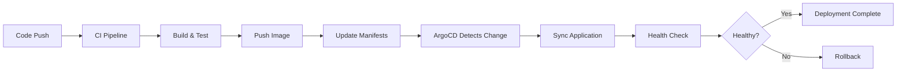

# ArgoCD Configuration for Bizra Genesis Node

This directory contains ArgoCD application definitions and configuration for GitOps continuous deployment.

## 🎯 GitOps Deployment Strategy

### Core Principles

1. **Declarative Configuration**: All Kubernetes manifests in Git
2. **Automated Sync**: ArgoCD continuously monitors and syncs
3. **Self-Healing**: Automatic drift detection and correction
4. **Progressive Rollout**: Gradual deployment with health checks
5. **Instant Rollback**: One-click revert to previous state

## 📁 Directory Structure

```
.github/workflows/argocd/
├── application.yml         # ArgoCD Application manifest
├── app-project.yml         # ArgoCD AppProject for RBAC
├── sync-waves.yml          # Deployment ordering configuration
└── notifications.yml       # Alert configuration for deployments
```

## 🚀 Setup Instructions

### Step 1: Install ArgoCD

```bash
# Create namespace
kubectl create namespace argocd

# Install ArgoCD
kubectl apply -n argocd -f https://raw.githubusercontent.com/argoproj/argo-cd/stable/manifests/install.yaml

# Wait for pods to be ready
kubectl wait --for=condition=Ready pods --all -n argocd --timeout=600s

# Get admin password
kubectl -n argocd get secret argocd-initial-admin-secret -o jsonpath="{.data.password}" | base64 -d

# Port forward to access UI
kubectl port-forward svc/argocd-server -n argocd 8080:443

# Login with CLI
argocd login localhost:8080 --username admin --password <password>
```

### Step 2: Configure Repository Access

```bash
# Add repository (HTTPS with token)
argocd repo add https://github.com/BizraInfo/bizra-genesis-node.git \
  --username <github-username> \
  --password <github-token> \
  --name bizra-genesis-node

# Or add repository (SSH)
argocd repo add git@github.com:BizraInfo/bizra-genesis-node.git \
  --ssh-private-key-path ~/.ssh/id_rsa \
  --name bizra-genesis-node
```

### Step 3: Create Application

```bash
# Create ArgoCD application
argocd app create bizra-genesis-node \
  --repo https://github.com/BizraInfo/bizra-genesis-node.git \
  --path k8s/base \
  --dest-server https://kubernetes.default.svc \
  --dest-namespace bizra-production \
  --sync-policy automated \
  --self-heal \
  --auto-prune

# Or apply from manifest
kubectl apply -f .github/workflows/argocd/application.yml
```

### Step 4: Configure GitHub Actions Secrets

```bash
# Generate ArgoCD API token
ARGOCD_TOKEN=$(argocd account generate-token --account github-actions)

# Add to GitHub repository secrets
# Name: ARGOCD_AUTH_TOKEN
# Value: <token from above>
```

## 📋 Application Configuration

### Application Manifest

```yaml
apiVersion: argoproj.io/v1alpha1
kind: Application
metadata:
  name: bizra-genesis-node
  namespace: argocd
  finalizers:
    - resources-finalizer.argocd.argoproj.io
spec:
  project: bizra-production
  
  source:
    repoURL: https://github.com/BizraInfo/bizra-genesis-node.git
    targetRevision: main
    path: k8s/base
  
  destination:
    server: https://kubernetes.default.svc
    namespace: bizra-production
  
  syncPolicy:
    automated:
      prune: true       # Remove resources not in Git
      selfHeal: true    # Sync when cluster state drifts
      allowEmpty: false
    syncOptions:
      - CreateNamespace=true
      - PrunePropagationPolicy=foreground
      - PruneLast=true
    retry:
      limit: 5
      backoff:
        duration: 5s
        factor: 2
        maxDuration: 3m
  
  revisionHistoryLimit: 10
  
  # Health assessment
  ignoreDifferences:
    - group: apps
      kind: Deployment
      jsonPointers:
        - /spec/replicas  # HPA manages replicas
```

## 🔄 Deployment Workflow

### Automated Deployment Flow



### Deployment Stages

1. **Pre-Sync**: Backup current state
2. **Sync**: Apply new manifests
3. **Post-Sync**: Run health checks
4. **Validation**: Smoke tests
5. **Evidence**: Collect deployment artifacts

### Progressive Rollout

ArgoCD + Kubernetes Rolling Update:
- **maxSurge: 1**: Add 1 new pod at a time
- **maxUnavailable: 0**: Zero-downtime guarantee
- **Health Probes**: Readiness gates prevent premature traffic
- **PDB**: Maintain minimum 2 replicas during rollout

## 📊 Monitoring Deployments

### ArgoCD UI

```bash
# Access ArgoCD UI
kubectl port-forward svc/argocd-server -n argocd 8080:443

# Navigate to: https://localhost:8080
# Login with admin credentials
```

### CLI Monitoring

```bash
# Get application status
argocd app get bizra-genesis-node

# Watch sync progress
argocd app sync bizra-genesis-node --watch

# View sync history
argocd app history bizra-genesis-node

# Get application resources
argocd app resources bizra-genesis-node

# View logs
argocd app logs bizra-genesis-node --follow
```

### Metrics & Alerts

ArgoCD exposes Prometheus metrics:
- `argocd_app_sync_total`: Total sync operations
- `argocd_app_sync_status`: Current sync status
- `argocd_app_health_status`: Application health
- `argocd_app_k8s_request_total`: K8s API calls

## 🔧 Operations

### Manual Sync

```bash
# Sync application
argocd app sync bizra-genesis-node

# Sync with prune
argocd app sync bizra-genesis-node --prune

# Sync specific resource
argocd app sync bizra-genesis-node --resource=deployment:bizra-genesis-node
```

### Rollback

```bash
# View deployment history
argocd app history bizra-genesis-node

# Rollback to previous version
argocd app rollback bizra-genesis-node 0

# Rollback to specific revision
argocd app rollback bizra-genesis-node 5
```

### Diff & Preview

```bash
# View differences between live and Git
argocd app diff bizra-genesis-node

# Preview sync changes
argocd app sync bizra-genesis-node --dry-run --prune
```

### Disaster Recovery

```bash
# Export application spec
argocd app get bizra-genesis-node -o yaml > backup.yml

# Export all application specs
argocd app list -o yaml > all-apps-backup.yml

# Restore application
kubectl apply -f backup.yml
```

## 🚨 Troubleshooting

### Application OutOfSync

```bash
# Check sync status
argocd app get bizra-genesis-node

# View sync operation details
argocd app sync bizra-genesis-node --info

# Force sync
argocd app sync bizra-genesis-node --force
```

### Sync Failures

```bash
# View sync errors
argocd app get bizra-genesis-node --show-operation

# Check application events
kubectl describe app bizra-genesis-node -n argocd

# View controller logs
kubectl logs -n argocd -l app.kubernetes.io/name=argocd-application-controller
```

### Resource Conflicts

```bash
# View resource differences
argocd app diff bizra-genesis-node --local k8s/base

# Prune unwanted resources
argocd app sync bizra-genesis-node --prune

# Sync with replace strategy
argocd app sync bizra-genesis-node --replace
```

## 🔐 Security Best Practices

### RBAC Configuration

```yaml
apiVersion: v1
kind: ServiceAccount
metadata:
  name: argocd-github-actions
  namespace: argocd
---
apiVersion: rbac.authorization.k8s.io/v1
kind: Role
metadata:
  name: argocd-sync-role
  namespace: argocd
rules:
  - apiGroups: ["argoproj.io"]
    resources: ["applications"]
    verbs: ["get", "patch", "update"]
---
apiVersion: rbac.authorization.k8s.io/v1
kind: RoleBinding
metadata:
  name: argocd-sync-binding
  namespace: argocd
subjects:
  - kind: ServiceAccount
    name: argocd-github-actions
roleRef:
  kind: Role
  name: argocd-sync-role
  apiGroup: rbac.authorization.k8s.io
```

### Token Management

- **Rotate tokens**: Every 90 days
- **Least privilege**: Limit token permissions
- **Audit logs**: Monitor token usage
- **Revoke unused**: Clean up old tokens

## 📈 Performance Optimization

### Sync Performance

```yaml
# In argocd-cm ConfigMap
data:
  application.resourceTrackingMethod: annotation  # Faster than label
  timeout.reconciliation: 180s
  timeout.hard.reconciliation: 0  # No hard timeout
```

### Resource Optimization

```yaml
# In argocd-repo-server deployment
resources:
  requests:
    cpu: 500m
    memory: 1Gi
  limits:
    cpu: 2000m
    memory: 2Gi
```

## 🎓 Elite Practitioner Standards

This GitOps setup follows **BIZRA Elite Full-Stack Blueprint** standards:

✅ **Automated deployment** with CI/CD integration  
✅ **Self-healing** with drift detection and correction  
✅ **Zero-downtime** with progressive rollout  
✅ **Evidence-based** with deployment artifacts  
✅ **Instant rollback** capability  
✅ **Audit trail** with Git history  
✅ **Security** with RBAC and token management  

---

**Elite DevOps Excellence - GitOps at Scale**
