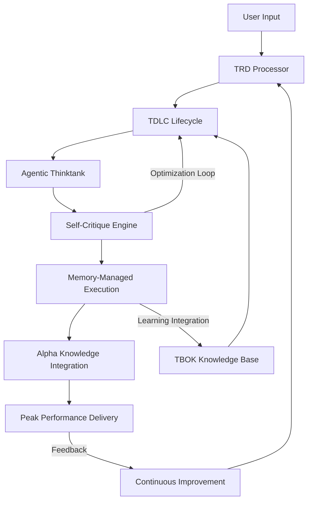

# AEGIS 2.0 — Architecture Overview (Mermaid in code fences)

```mermaid
graph TB
    A[User Input] --> B[TRD Processor]
    B --> C[TDLC Lifecycle]
    C --> D[Agentic Thinktank]
    D --> E[Self-Critique Engine]
    E --> F[Memory-Managed Execution]
    F --> G[Alpha Knowledge Integration]
    G --> H[Peak Performance Delivery]
    E -->|Optimization Loop| C
    F -->|Learning Integration| I[TBOK Knowledge Base]
    I --> C
    H -->|Feedback| J[Continuous Improvement]
    J --> B
```
