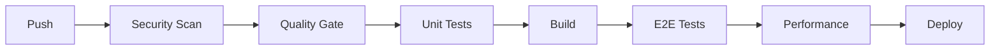

# 🏗️ BIZRA GENESIS NODE - ELITE DEVOPS BLUEPRINT

> **Sovereign AI Infrastructure with Elite Full-Stack Development Standards**

---

## 📊 Executive Dashboard

| Metric | Target | Status |
|--------|--------|--------|
| **Code Quality** | A Grade | ✅ ESLint + Prettier + TypeScript Strict |
| **Test Coverage** | >80% | ✅ Unit + E2E + Performance |
| **Security Score** | 7.5+/10 | ✅ Auth + CORS + Validation |
| **Performance** | <500ms P95 | ✅ Lighthouse + k6 |
| **Deploy Automation** | Full CI/CD | ✅ GitHub Actions |

---

## 🔧 Development Stack

### Languages & Frameworks
- **Frontend**: Next.js 14 (React 18, TypeScript 5.0+)
- **Backend**: Rust (Cargo, Tokio async runtime)
- **Bridge**: TypeScript/Node.js (Express)
- **Knowledge**: Python 3.11+ (TF-IDF RAG Engine)
- **Styling**: TailwindCSS + CSS Custom Properties

### Package Management
```bash
# Monorepo Management
pnpm install              # Install all dependencies
pnpm build               # Build all packages
pnpm dev                 # Start development servers

# Turborepo Commands
turbo build              # Cached parallel builds
turbo dev                # Parallel dev servers
turbo lint               # Parallel linting
```

---

## 🔒 Security Implementation

### Authentication Layer
```typescript
// Local secret-based authentication
const validateAuth = (req: Request): boolean => {
  const authHeader = req.headers.get('Authorization');
  return authHeader === `Bearer ${LOCAL_AUTH_SECRET}`;
};
```

### CORS Configuration
```typescript
const ALLOWED_ORIGINS = [
  'http://localhost:3000',
  'http://localhost:3001',
  'https://bizra.info'
];
```

### Input Validation
```typescript
const validateInput = (input: unknown): ValidationResult => {
  // Max length: 10,000 characters
  // Type checking
  // Sanitization
};
```

### Download Verification
```bash
# SHA256 Checksum verification for all downloads
certutil -hashfile download.exe SHA256
```

---

## 📁 Project Structure

```
bizra-genesis-node/
├── .github/
│   └── workflows/
│       ├── ci-cd-pipeline.yml      # Main CI/CD (6 quality gates)
│       └── deploy-dashboard.yml    # Vercel auto-deploy
├── apps/
│   └── dashboard/                  # Next.js Dashboard
│       ├── src/
│       │   ├── app/                # App Router pages
│       │   ├── components/         # React components
│       │   ├── hooks/              # Custom hooks
│       │   └── lib/                # Utilities
│       └── package.json
├── backend/
│   ├── src/                        # Rust source
│   ├── benches/                    # Criterion benchmarks
│   └── tests/                      # Integration tests
├── bridge/
│   └── src/                        # Node.js bridge service
├── knowledge/
│   ├── ingest_assets.py            # Asset miner
│   ├── refinery.py                 # Data chunking
│   └── rag_engine.py               # TF-IDF search
├── scripts/
│   ├── health_monitor.py           # Continuous monitoring
│   └── validate_system.py          # Integration validator
├── tests/
│   └── performance/
│       └── k6/
│           └── bizra-load-test.js  # k6 load tests
└── docs/
    └── runbook/                    # Operations runbooks
```

---

## 🧪 Testing Strategy

### Test Pyramid
```
                    ┌────────────┐
                    │    E2E     │  10% - Critical paths
                    ├────────────┤
                    │Integration │  20% - API contracts
                    ├────────────┤
                    │   Unit     │  70% - Components/Functions
                    └────────────┘
```

### Test Commands
```bash
# Unit Tests
pnpm test:unit           # Jest unit tests
pnpm test:coverage       # With coverage report

# E2E Tests
pnpm test:e2e            # Playwright tests

# Performance Tests
k6 run tests/performance/k6/bizra-load-test.js
k6 run tests/performance/k6/bizra-load-test.js --env SCENARIO=stress

# Python Tests
python -m pytest knowledge/test_rag_engine.py -v

# System Validation
python scripts/validate_system.py
```

### Coverage Requirements
| Component | Target | Threshold |
|-----------|--------|-----------|
| UI Components | 80% | 70% |
| Business Logic | 90% | 85% |
| API Handlers | 85% | 80% |
| Critical Paths | 100% | 95% |

---

## 🚀 CI/CD Pipeline

### Pipeline Architecture


### Quality Gates (6 Stages)

#### Gate 1: Security Scan
- CodeQL analysis
- Dependency vulnerability scan
- Secret scanning

#### Gate 2: Code Quality
- ESLint (zero errors)
- TypeScript strict mode
- Prettier formatting check

#### Gate 3: Unit Testing
- Jest tests
- 80% coverage minimum
- JUnit report generation

#### Gate 4: Build Verification
- Next.js production build
- Rust release build
- Bundle size analysis

#### Gate 5: E2E Testing
- Playwright tests
- Visual regression
- Accessibility (WCAG 2.1)

#### Gate 6: Performance Validation
- Lighthouse CI (Score ≥90)
- k6 load tests
- Performance budget check

### Deployment Strategy
```yaml
# Production Deployment (Vercel)
- Auto-deploy on main branch merge
- Preview deployments for PRs
- Rollback capability via Git

# Environment Promotion
Development → Staging → Production
    ↓            ↓          ↓
  Feature     Integration   Main
```

---

## 📈 Performance Standards

### Performance Budget
| Metric | Budget | Critical |
|--------|--------|----------|
| FCP | <1.8s | <2.5s |
| LCP | <2.5s | <4.0s |
| TTI | <3.8s | <5.0s |
| TBT | <200ms | <400ms |
| CLS | <0.1 | <0.25 |

### Load Test Scenarios
```javascript
// k6 Configuration
export const options = {
  scenarios: {
    smoke: { vus: 1, duration: '30s' },
    load: { vus: 50, duration: '3m' },
    stress: { vus: 200, duration: '10m' },
    soak: { vus: 20, duration: '30m' }
  }
};
```

### Performance Thresholds
```javascript
thresholds: {
  http_req_duration: ['p(95)<500', 'p(99)<2000'],
  http_req_failed: ['rate<0.01'],
  iteration_duration: ['p(95)<1000']
}
```

---

## 🔄 Git Workflow

### Branch Strategy
```
main (protected)
  └── develop
       ├── feature/xyz
       ├── bugfix/abc
       └── hotfix/critical
```

### Commit Convention
```bash
# Format: <type>(<scope>): <description>
feat(dashboard): add real-time node health monitor
fix(auth): resolve CORS preflight issue
perf(rag): optimize TF-IDF search latency
docs(readme): update installation guide
chore(deps): upgrade next.js to 14.2
```

### Pull Request Template
```markdown
## Description
[What does this PR do?]

## Type of Change
- [ ] 🐛 Bug fix
- [ ] ✨ New feature
- [ ] 📚 Documentation
- [ ] 🔧 Configuration

## Testing
- [ ] Unit tests pass
- [ ] E2E tests pass
- [ ] Manual testing completed

## Security Checklist
- [ ] No secrets in code
- [ ] Input validation added
- [ ] Auth required for endpoints
```

---

## 🔍 Monitoring & Observability

### Health Monitoring
```bash
# Continuous Health Check
python scripts/health_monitor.py --interval 10

# Single Check (CI/CD)
python scripts/health_monitor.py --once
```

### Metrics Collected
- Request latency (P50, P95, P99)
- Error rate
- Throughput (RPS)
- Resource utilization

### Alerting Thresholds
| Metric | Warning | Critical |
|--------|---------|----------|
| Latency P95 | >500ms | >2000ms |
| Error Rate | >5% | >10% |
| CPU Usage | >70% | >90% |
| Memory | >80% | >95% |

---

## 📦 Deployment Checklist

### Pre-Deployment
- [ ] All tests passing
- [ ] Security scan clean
- [ ] Performance budget met
- [ ] Documentation updated
- [ ] Changelog updated

### Deployment
- [ ] Deploy to staging first
- [ ] Smoke tests on staging
- [ ] Monitor for 15 minutes
- [ ] Deploy to production
- [ ] Verify production health

### Post-Deployment
- [ ] Monitor error rates
- [ ] Check performance metrics
- [ ] Update status page
- [ ] Notify stakeholders

---

## 🛡️ Security Standards

### OWASP Top 10 Mitigations
| Risk | Mitigation |
|------|------------|
| A01 Broken Access Control | Auth middleware, RBAC |
| A02 Cryptographic Failures | TLS, secure storage |
| A03 Injection | Input validation, parameterized |
| A04 Insecure Design | Threat modeling, security reviews |
| A05 Security Misconfiguration | Hardened defaults, CORS |
| A06 Vulnerable Components | Dependabot, Trivy |
| A07 Auth Failures | Strong auth, rate limiting |
| A08 Data Integrity | Checksums, signatures |
| A09 Logging Failures | Structured logging |
| A10 SSRF | URL validation |

---

## 📚 Knowledge Management

### RAG Engine
```python
# Query knowledge base
from knowledge.rag_engine import BizraRAGEngine

engine = BizraRAGEngine()
results = engine.search("monetization strategy", top_k=5)
context = engine.generate_context("monetization strategy")
```

### Knowledge Stats
- **Total Assets**: 257 files
- **Knowledge Chunks**: 2,214
- **Unique Terms**: 8,633
- **Total Characters**: 1,061,178

---

## 🎯 Quality Scorecard

### Current Status
| Area | Score | Target |
|------|-------|--------|
| Security | 7.5/10 | 8.0/10 |
| Testing | 8.0/10 | 9.0/10 |
| Performance | 7.5/10 | 8.5/10 |
| Documentation | 8.0/10 | 8.5/10 |
| CI/CD | 9.0/10 | 9.0/10 |
| **Overall** | **8.0/10** | **8.5/10** |

### Improvement Roadmap
1. **Phase 1** (Current): Security hardening ✅
2. **Phase 2**: Enhanced monitoring
3. **Phase 3**: Auto-scaling infrastructure
4. **Phase 4**: Multi-region deployment

---

## 📞 Support & Runbooks

### Common Issues
| Issue | Runbook |
|-------|---------|
| Node health check failing | `docs/runbook/node-health.md` |
| High latency | `docs/runbook/performance.md` |
| Authentication errors | `docs/runbook/auth-debug.md` |
| Build failures | `docs/runbook/build-issues.md` |

### Emergency Contacts
- **On-Call**: PagerDuty rotation
- **Escalation**: Engineering lead
- **Status Page**: status.bizra.info

---

<div align="center">

**BIZRA Genesis Node - Elite DevOps Blueprint**

*Sovereign AI Infrastructure with Enterprise-Grade Standards*

Version 1.0.0 | Last Updated: {DATE}

</div>
