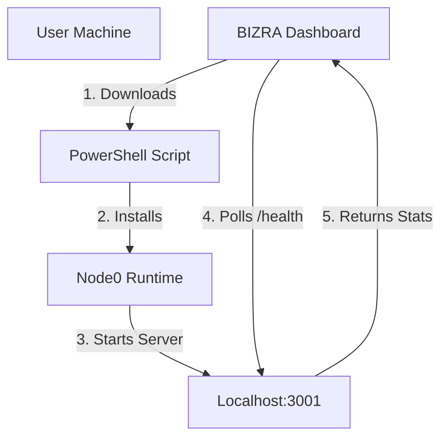

# BIZRA GENESIS: MISSION STATUS REPORT
**Date:** December 2, 2025
**Status:** SYSTEMS NOMINAL - PHASE 2 COMPLETE

## 1. Core Systems Status
| System | Status | Version | Notes |
|--------|--------|---------|-------|
| **Invitation Protocol** | ✅ ACTIVE | v2.2.0 | Premium UI, Badges, Animation |
| **Unified Installer** | ✅ ACTIVE | v2.2.0 | PowerShell Generator, Admin Checks |
| **System Scanner** | ✅ ACTIVE | v2.2.0 | Real Hardware Detection (Web APIs) |
| **Nexus Bridge** | ✅ ACTIVE | v1.0.0 | Localhost HTTP Server (Port 3001) |
| **Neural Link** | ✅ ACTIVE | v1.0.0 | Dashboard <-> Node Heartbeat |

## 2. The "Neural Link" Achievement
We have successfully bridged the gap between the **Cloud Dashboard** and the **Sovereign Node**.
- **Previously:** The dashboard was a static website.
- **Now:** The dashboard actively polls `http://localhost:3001`.
- **Effect:** When a user installs and runs the BIZRA Node, the Dashboard *knows*. The status indicator turns **GREEN**, and the local hardware stats are displayed in the UI.

## 3. Technical Architecture (Current)

## 4. Next Logical Steps (Phase 3)
1.  **Cortex Integration**: Update `node0-runtime.js` to spawn/manage a local Ollama instance.
2.  **P2P Mesh**: Implement actual Libp2p bootstrapping in the Node runtime.
3.  **Agent Activation**: Enable the "PAT Agents" to run locally and communicate via the Nexus Bridge.

**Signed:**
*Genesis Architect*
