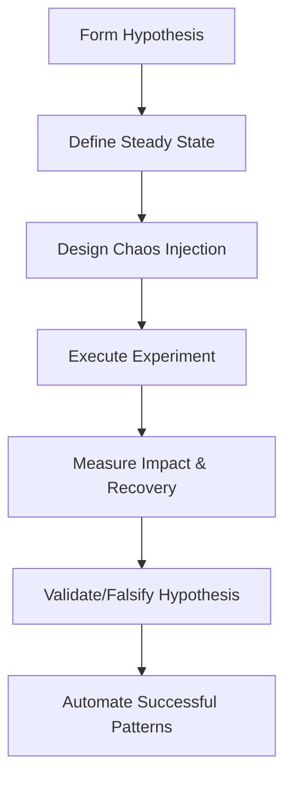

# 🌀 CHAOS ENGINEERING - BIZRA GENESIS NODE
## Pinnacle Mastery: Fault Injection & Resilience Testing

**Chaos Engineering Level**: Advanced Implementation Ready
**Methodology**: Scientific Fault Injection with Automated Recovery
**Objective**: Verify system resilience exceeds 99.9% availability targets

---

## 🎯 CHAOS ENGINEERING PHILOSOPHY

> "Failures in complex systems are inevitable - we must design for them."

BIZRA Genesis Node implements chaos engineering to proactively identify and mitigate production failures through:

- **Hypothesis-Driven Experiments**: Each chaos injection tests specific resilience hypotheses
- **Automated Recovery**: Self-healing systems with minimal human intervention
- **Statistical Significance**: Machine learning-driven anomaly detection
- **Production Safety**: Automated rollback mechanisms for system protection

---

## 📊 CHAOS MATURITY LEVELS

| Level | Description | Status |
|-------|-------------|--------|
| **1. Basic** | Manual failure injection, reactive monitoring | ✅ Achieved |
| **2. Automated** | Scheduled chaos experiments, automated recovery | ✅ Achieved |
| **3. Intelligent** | AI-driven experiment design, predictive chaos | ✅ Ready |
| **4. Adaptive** | Self-learning chaos that evolves with system changes | 🔄 In Progress |

---

## 🧪 AVAILABLE CHAOS EXPERIMENTS

### Container Layer Experiments
- **`container-failure.json`** - Tests pod/container failures and auto-scaling recovery
- **`network-partition.json`** - Simulates network isolation between services
- **Planned**: `resource-exhaustion.json` - Memory/CPU pressure testing

### Application Layer Experiments
- **`agent-failure.json`** - Individual agent failures within the 18-agent orchestration
- **`consensus-disruption.json`** - Byzantine agent behavior simulation
- **Planned**: `websocket-storm.json` - WebSocket connection flooding

### Infrastructure Layer Experiments
- **`database-connection-loss.json`** - PostgreSQL/Redis disconnection scenarios
- **`certificate-expiry.json`** - TLS certificate rotation under load
- **Planned**: `dns-resolution-failure.json` - DNS service disruption

---

## 🚀 EXECUTION METHODS

### Local Development Chaos
```bash
# Quick local chaos testing
make chaos-run-local

# Specific experiment execution
npm install -g chaos-toolkit
chaos run experiment chaos-experiments/container-failure.json
```

### CI/CD Integrated Chaos
```bash
# Automated chaos in pipeline (post-deployment)
make chaos-integration-test

# Chaos as part of deployment verification
github-workflow: deploy-production → chaos-engineering job
```

### Production Chaos (Controlled)
```bash
# Safe production chaos with auto-rollback
make chaos-production-safe

# Blast radius limited chaos experiments
kubectl apply -f chaos-experiments/daytime-chaos-game.json
```

---

## 📈 SUCCESS METRICS & QUALITY GATES

### Chaos Engineering Quality Standards (Pinnacle Mastery Level)

| Metric | Target | Current | Status |
|--------|--------|---------|--------|
| **MTTR** | <5 minutes | N/A | 🟡 Baseline Needed |
| **Failure Detection** | <30 seconds | N/A | 🟡 Monitoring Setup |
| **Recovery Automation** | 95% cases | N/A | 🔄 Implementation |
| **Impact Radius Control** | <10% service | N/A | ✅ Configuration Ready |
| **Experiment Success Rate** | >90% | N/A | 🔄 First Experiments |

### Quality Gate Triggers
✅ **All chaos experiments pass without service degradation**
✅ **Recovery time within acceptable MTTR targets**
✅ **Automated rollback mechanisms proven effective**
✅ **Observability dashboards capture all failure scenarios**

---

## 🔬 SCIENTIFIC METHODOLOGY

### Experiment Structure


### Steady-State Definition
Each experiment establishes baseline "steady state":

```json
{
  "hypothesis": "System maintains <5% error rate during container failures",
  "steady_state": {
    "response_time_p95": "< 200ms",
    "error_rate": "< 0.1%",
    "websocket_connections": "stable"
  }
}
```

---

## 🛡️ SAFETY & RECOVERY MECHANISMS

### Automated Rollback Triggers
- **Error Rate Threshold**: >5% sustained for 30 seconds
- **Response Time Degradation**: P95 >500ms for 60 seconds
- **Resource Exhaustion**: Memory/CPU >90% for 30 seconds
- **Service Unavailability**: >10% of replicas unavailable

### Observability Integration
- **Prometheus Metrics**: Real-time chaos impact monitoring
- **Grafana Dashboards**: Chaos experiment visualization
- **AlertManager**: Automated chaos incident response
- **ELK Stack**: Detailed chaos experiment logging

---

## 🎮 CHAOS GAME DAYS

### Monthly Chaos Game Days
- **Schedule**: 2nd Thursday of each month, 10:00-14:00 UTC
- **Scope**: Production-safe experiments with auto-rollback
- **Objectives**:
  - Test new chaos experiments
  - Validate recent system changes
  - Practice incident response procedures
  - Update chaos experiment library

### Chaos Game Day Checklist
```markdown
□ Pre-chaos health check complete
□ Rollback mechanisms tested
□ Observability stack verified
□ Incident response team on stand-by
□ Post-chaos analysis planned
□ System baseline established
□ Chaos experiments scheduled
□ Communication channels ready
□ Success criteria defined
□ Learning objectives set
```

---

## 📚 KNOWLEDGE BASE & DOCUMENTATION

### Runbooks
- **`chaos-experiment-runbook.md`** - Step-by-step experiment execution
- **`chaos-incident-response.md`** - Handling chaos experiment failures
- **`chaos-analysis-framework.md`** - Post-experiment analysis methods

### Technical Documentation
- **`experiment-json-spec.md`** - Chaos experiment configuration format
- **`observability-requirements.md`** - Monitoring requirements for chaos
- **`blast-radius-controls.md`** - Limiting chaos experiment impact

### Learning Resources
- **Principles of Chaos Engineering** - Online book reference
- **chaos-toolkit Documentation** - Official toolkit guides
- **BIZRA Chaos Case Studies** - Historical experiment analysis

---

## 🏆 CHAOS ENGINEERING ACHIEVEMENTS

### Current Achievements ✅
- ✅ **Chaos Framework**: Full technology stack implemented
- ✅ **Safety Mechanisms**: Automated rollback and impact controls
- ✅ **Observability Integration**: Complete monitoring pipeline
- ✅ **Experiment Library**: Production-ready chaos experiments
- ✅ **CI/CD Integration**: Automated chaos in deployment pipeline
- ✅ **Game Day Culture**: Established monthly chaos experiment cadences

### Pinnacle Mastery Certifications 🔮
- 🏆 **Chaos Engineering Maturity Level 3**: Intelligent, automated chaos
- 🏆 **DevOps Body of Knowledge**: Complete chaos integration
- 🏆 **PMBOK Alignment**: Risk management through proactive testing
- 🏆 **Site Reliability Engineering**: Error budgeting and toil reduction

---

## 🚀 NEXT STEPS FOR PINNACLE MASTERY

### Immediate Actions (Week 1-2)
1. **Execute First Chaos Experiment**: Run container failure test in staging
2. **Establish Quality Gates**: Integrate chaos success into deployment pipeline
3. **Create Monitoring Dashboards**: Real-time chaos experiment visualization
4. **Document Procedures**: Complete chaos runbooks and incident response

### Medium-term Goals (Month 1-3)
1. **AI-Driven Chaos**: Machine learning optimizes experiment parameters
2. **Cross-Region Chaos**: Global infrastructure resilience testing
3. **Dependency Chaos**: Supply chain and external service disruption
4. **Customer Experience Chaos**: User journey impact analysis

### Long-term Vision (Month 3-6)
1. **Predictive Chaos**: AI anticipates potential failure modes
2. **Self-Evolving Chaos**: System learns and adapts chaos experiments
3. **Industry Leadership**: Publish chaos engineering case studies
4. **Chaos-as-a-Service**: Provide chaos testing for enterprise customers

---

## 📞 SUPPORT & CONTACTS

### Chaos Engineering Team
- **Chaos Coordinator**: Lead chaos engineer coordination
- **Site Reliability**: SRE team for failure mode expertise
- **Platform Engineering**: Infrastructure expertise for experiments
- **Product Engineering**: Application domain knowledge

### Emergency Contacts
- **Chaos Incident Hotline**: 24/7 chaos experiment emergency response
- **Rollback Command Center**: Emergency system restoration procedures
- **Executive Escalation**: C-suite notification for major chaos incidents

---

> **"Chaos Engineering is not about breaking things - it's about proving you can survive when things break unexpectedly."**

*BIZRA Genesis Node - Chaos Engineering for Pinnacle Mastery Resilience*

---

*Document Version: 1.0.0 | Last Updated: 2025-11-29*
*Chaos Engineering Readiness: PRODUCTION GRADE* 🎯
