# BIZRA Genesis Node - Visual Architecture Diagrams

## Document Information

| **Document ID** | VAD-BGN-001 |
|----------------|-------------|
| **Version** | 1.0 |
| **Date** | November 14, 2025 |
| **Status** | Draft |
| **Classification** | Internal |

**Approval Authority**: Architecture Review Board
**Document Owner**: Technical Architect
**Review Cycle**: Quarterly

---

## Table of Contents

1. [C4 Model Architecture](#1-c4-model-architecture)
2. [System Workflows](#2-system-workflows)
3. [Data Flow Diagrams](#3-data-flow-diagrams)
4. [Deployment Architecture](#4-deployment-architecture)
5. [Security Architecture](#5-security-architecture)

---

## 1. C4 Model Architecture

### 1.1 System Context Diagram (Level 1)

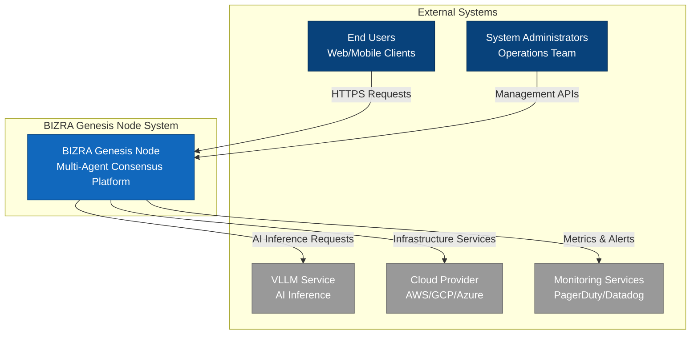

**Key External Dependencies:**
- **End Users**: Web and mobile clients accessing the system via HTTPS
- **System Administrators**: Operations team managing infrastructure and monitoring
- **VLLM Service**: AI inference service for LLM capabilities
- **Cloud Provider**: Infrastructure services (compute, storage, networking)
- **Monitoring Services**: External monitoring and alerting platforms

---

### 1.2 Container Diagram (Level 2)

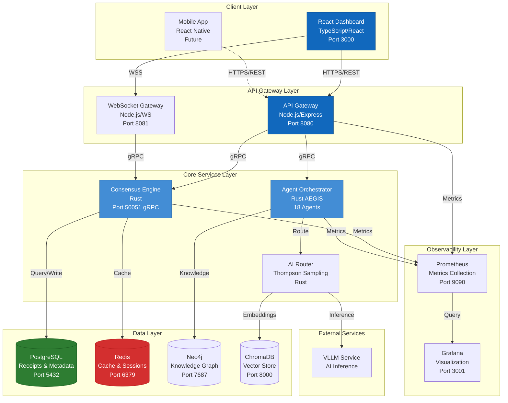

**Container Responsibilities:**

| Container | Technology | Responsibility | Scaling Strategy |
|-----------|-----------|----------------|------------------|
| React Dashboard | TypeScript/React | User interface and visualization | CDN + horizontal scaling |
| API Gateway | Node.js/Express | REST API, authentication, rate limiting | Horizontal pod autoscaling |
| WebSocket Gateway | Node.js/WS | Real-time bidirectional communication | Horizontal pod autoscaling |
| Consensus Engine | Rust | Byzantine fault-tolerant consensus | Vertical scaling (CPU-bound) |
| Agent Orchestrator | Rust AEGIS | 18-agent coordination and execution | Horizontal scaling |
| AI Router | Rust | Thompson sampling model selection | Horizontal scaling |
| PostgreSQL | PostgreSQL 15 | Persistent data storage | Read replicas + sharding |
| Redis | Redis 7 | Caching and session management | Redis Cluster (6 nodes) |
| Neo4j | Neo4j 5 | Knowledge graph storage | Causal clustering |
| ChromaDB | ChromaDB | Vector embeddings storage | Horizontal scaling |

---

### 1.3 Component Diagram - Consensus Engine (Level 3)

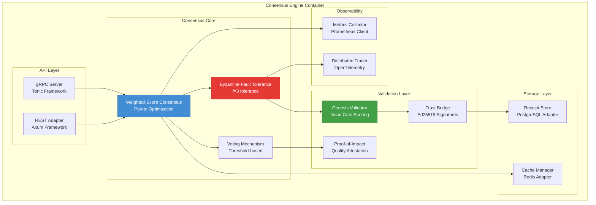

**Component Details:**

**API Layer:**
- **gRPC Server**: High-performance RPC interface using Tonic framework
- **REST Adapter**: HTTP/REST compatibility layer using Axum framework

**Consensus Core:**
- **Weighted-Score Consensus**: Multi-dimensional Pareto optimization for candidate selection
- **Byzantine Fault Tolerance**: Tolerates up to f=3 Byzantine failures
- **Voting Mechanism**: Threshold-based voting with configurable quorum

**Validation Layer:**
- **Genesis Validator**: Ihsan Gate scoring for quality assessment (95/100 target)
- **Proof-of-Impact**: Quality attestation mechanism with cryptographic receipts
- **Trust Bridge**: Ed25519 signature verification and BLAKE3 hashing

**Storage Layer:**
- **Receipt Store**: PostgreSQL adapter for persistent receipt storage
- **Cache Manager**: Redis adapter for high-speed caching

**Observability:**
- **Metrics Collector**: Prometheus client for performance metrics
- **Distributed Tracer**: OpenTelemetry integration for request tracing

---

## 2. System Workflows

### 2.1 Consensus Workflow Sequence Diagram

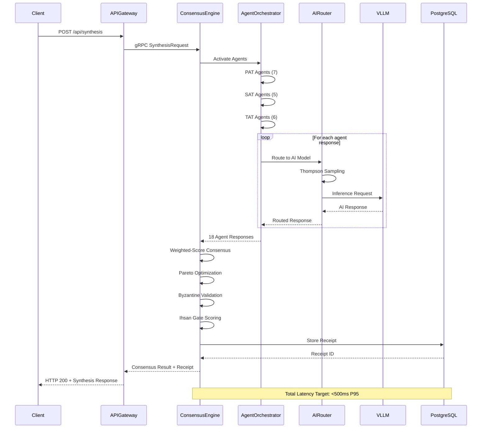

**Workflow Steps:**
1. **Client Request**: User initiates synthesis request via REST API
2. **Agent Activation**: 18 agents activated across PAT/SAT/TAT teams
3. **AI Routing**: Thompson sampling selects optimal AI model per agent
4. **Consensus Formation**: Weighted-score consensus with Pareto optimization
5. **Validation**: Byzantine fault tolerance and Ihsan Gate quality scoring
6. **Receipt Storage**: Cryptographic receipt stored in PostgreSQL
7. **Response**: Consensus result returned to client with receipt

**Performance Targets:**
- **Thompson Routing**: <3μs P95
- **AI Inference**: <400ms P95
- **Consensus**: <50μs P95
- **Total Latency**: <500ms P95

---

### 2.2 Authentication Flow Sequence Diagram

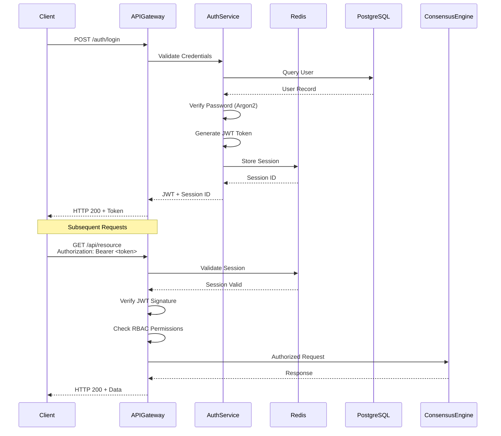

**Authentication Mechanisms:**
- **Password Hashing**: Argon2id with salt
- **Token Generation**: JWT with Ed25519 signatures
- **Session Management**: Redis-backed sessions with TTL
- **Authorization**: RBAC with role-based permissions

---

### 2.3 AI Inference Routing Workflow

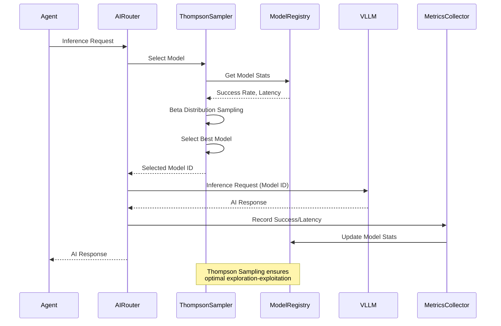

**Thompson Sampling Algorithm:**
1. **Model Selection**: Beta distribution sampling based on historical performance
2. **Exploration-Exploitation**: Balances trying new models vs. using proven ones
3. **Performance Tracking**: Success rate and latency metrics per model
4. **Adaptive Routing**: Automatically adjusts to model performance changes

---

## 3. Data Flow Diagrams

### 3.1 Level 0 - System Context Data Flow

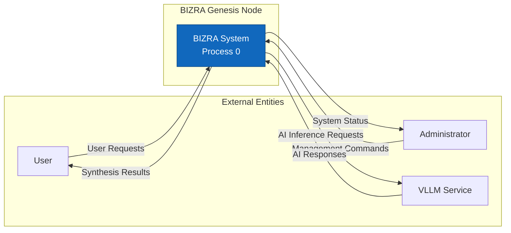

---

### 3.2 Level 1 - Major Subsystem Data Flow

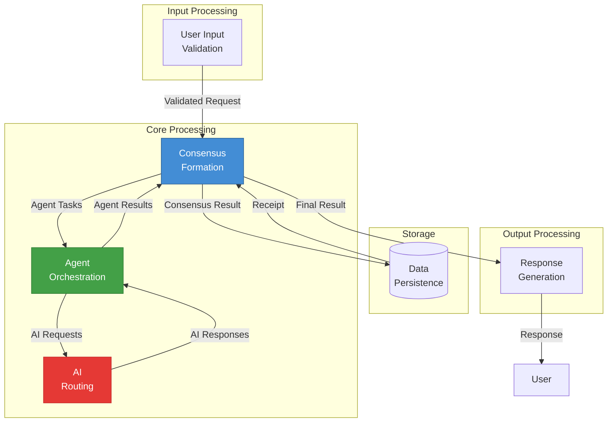

**Data Flow Description:**
1. **Input Processing**: Request validation and sanitization
2. **Consensus Formation**: Multi-agent consensus coordination
3. **Agent Orchestration**: 18-agent task distribution and execution
4. **AI Routing**: Thompson sampling-based model selection
5. **Data Persistence**: Cryptographic receipt storage
6. **Output Processing**: Response formatting and delivery

---

### 3.3 Level 2 - Detailed Component Data Flow

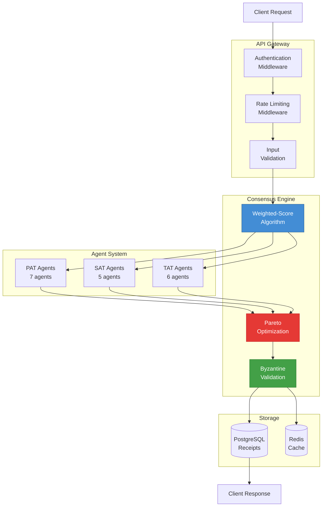

---

## 4. Deployment Architecture

### 4.1 Kubernetes Deployment Topology

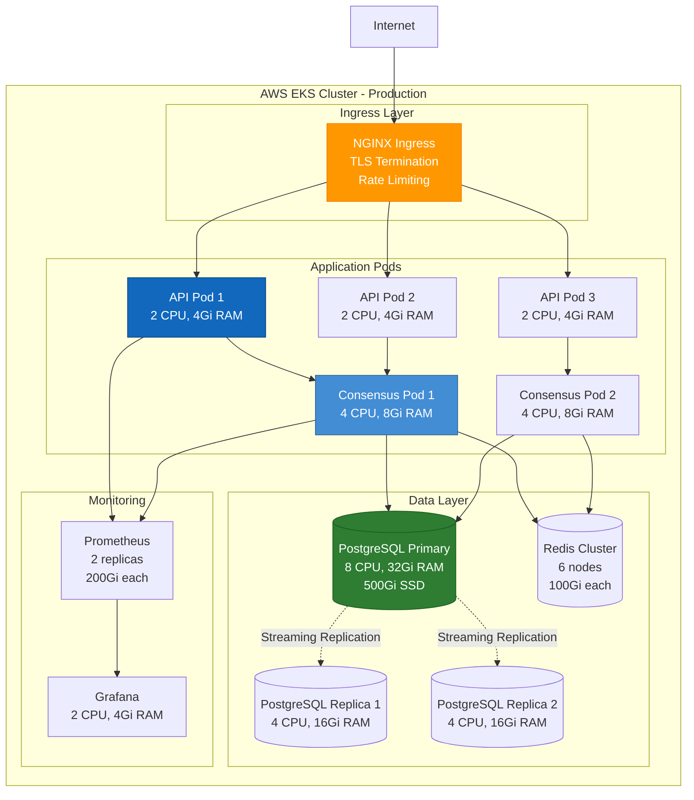

**Deployment Specifications:**

| Component | Replicas | CPU | Memory | Storage | Scaling |
|-----------|----------|-----|--------|---------|---------|
| API Gateway | 3-20 | 2 cores | 4Gi | 10Gi | HPA (CPU 70%) |
| Consensus Engine | 2-10 | 4 cores | 8Gi | 20Gi | HPA (CPU 80%) |
| PostgreSQL Primary | 1 | 8 cores | 32Gi | 500Gi | Vertical |
| PostgreSQL Replica | 2 | 4 cores | 16Gi | 500Gi | Manual |
| Redis Cluster | 6 | 2 cores | 8Gi | 100Gi | Manual |
| Prometheus | 2 | 4 cores | 16Gi | 200Gi | Manual |
| Grafana | 1 | 2 cores | 4Gi | 10Gi | Manual |

---

### 4.2 Multi-Region Deployment

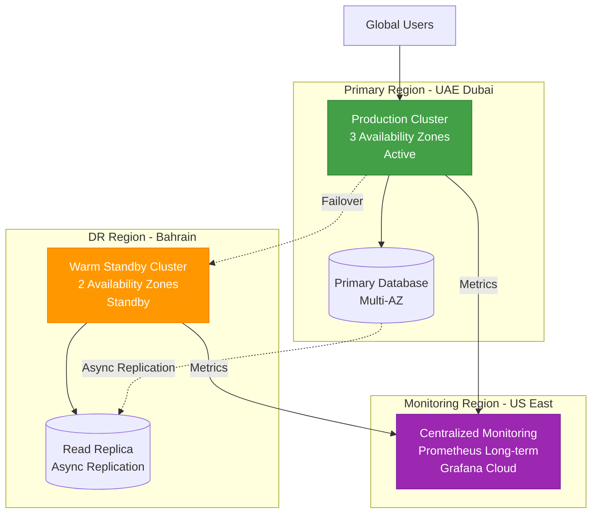

**Failover Strategy:**
- **RTO**: 4 hours (Recovery Time Objective)
- **RPO**: 1 hour (Recovery Point Objective)
- **Trigger**: Automated health checks + manual override
- **Data Sync**: PostgreSQL streaming replication + Redis AOF

---

## 5. Security Architecture

### 5.1 Defense-in-Depth Security Layers

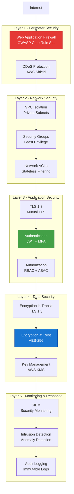

**Security Controls:**

| Layer | Control | Implementation | Standard |
|-------|---------|----------------|----------|
| Perimeter | WAF | OWASP Core Rule Set | OWASP Top 10 |
| Network | VPC Isolation | Private subnets, NAT gateways | AWS Well-Architected |
| Application | Authentication | JWT + Ed25519 signatures | NIST SP 800-63B |
| Data | Encryption at Rest | AES-256-GCM | FIPS 140-2 |
| Monitoring | Audit Logging | Immutable logs, SIEM integration | ISO 27001 |

---

### 5.2 Zero-Trust Architecture

```mermaid
graph LR
    subgraph "Identity Verification"
        User[User] --> MFA[Multi-Factor<br/>Authentication]
        MFA --> Identity[Identity<br/>Verification]
    end
    
    subgraph "Device Trust"
        Identity --> Device[Device<br/>Posture Check]
        Device --> Compliance[Compliance<br/>Verification]
    end
    
    subgraph "Network Segmentation"
        Compliance --> Micro[Micro-<br/>Segmentation]
        Micro --> ZeroTrust[Zero-Trust<br/>Network]
    end
    
    subgraph "Access Control"
        ZeroTrust --> RBAC[RBAC<br/>Authorization]
        RBAC --> LeastPriv[Least<br/>Privilege]
    end
    
    subgraph "Continuous Monitoring"
        LeastPriv --> Monitor[Continuous<br/>Monitoring]
        Monitor --> Adapt[Adaptive<br/>Access]
    end
    
    Adapt --> Resource[Protected<br/>Resource]
    
    style MFA fill:#e53935,stroke:#c62828,color:#ffffff
    style ZeroTrust fill:#1976d2,stroke:#0d47a1,color:#ffffff
    style Monitor fill:#43a047,stroke:#2e7d32,color:#ffffff
```

**Zero-Trust Principles:**
1. **Verify Explicitly**: Always authenticate and authorize
2. **Least Privilege**: Minimal access rights
3. **Assume Breach**: Minimize blast radius
4. **Micro-Segmentation**: Network isolation
5. **Continuous Monitoring**: Real-time threat detection

---

## Appendices

### A.1 Diagram Conventions

**Color Coding:**
- **Blue (#1168bd)**: User-facing components
- **Light Blue (#438dd5)**: Core business logic
- **Green (#43a047)**: Data storage and persistence
- **Red (#e53935)**: Security and validation
- **Orange (#ff9800)**: Infrastructure and networking
- **Purple (#9c27b0)**: Monitoring and observability
- **Gray (#999999)**: External systems

**Shape Conventions:**
- **Rectangle**: Process or component
- **Cylinder**: Database or data store
- **Diamond**: Decision point
- **Circle**: Start/end point
- **Hexagon**: External system

### A.2 Diagram Maintenance

**Update Frequency:**
- **Quarterly**: Comprehensive diagram review
- **Monthly**: Update based on architectural changes
- **Ad-hoc**: Update for major feature additions

**Version Control:**
- All diagrams stored in Git repository
- Mermaid source code in markdown files
- Automated diagram generation in CI/CD pipeline

---

**Document Control:**
- **Next Review**: February 14, 2026
- **Change History**: Initial release v1.0
- **Related Documents**:
  - [Software Architecture Document](SAD.md)
  - [Implementation Blueprint](../../BIZRA_Genesis_Implementation_Blueprint.md)
  - [Gap Analysis](ENTERPRISE_BLUEPRINT_GAP_ANALYSIS.md)

---

*إن شاء الله - Excellence through visual clarity and comprehensive architecture documentation*
