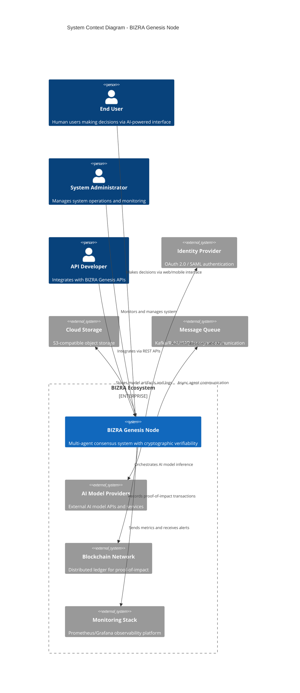
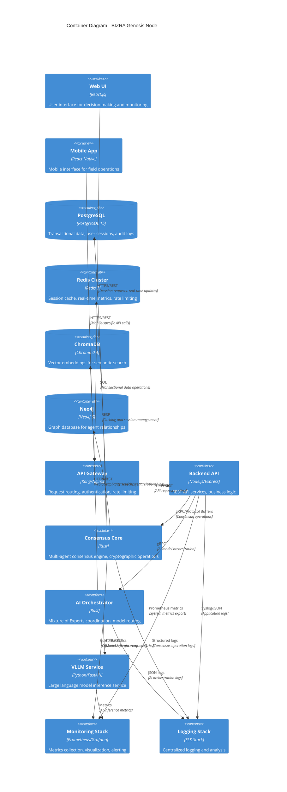
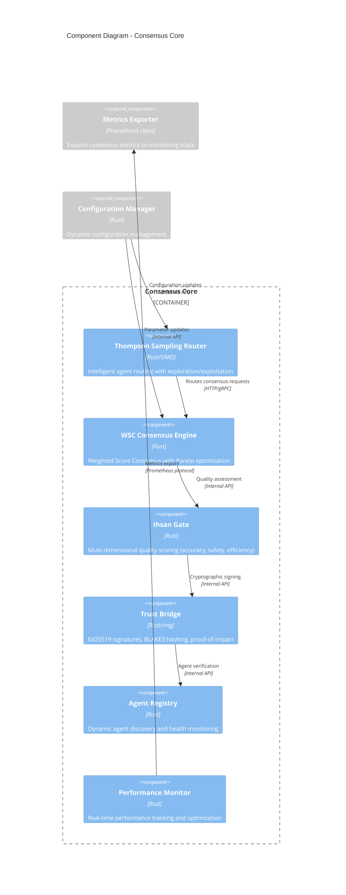
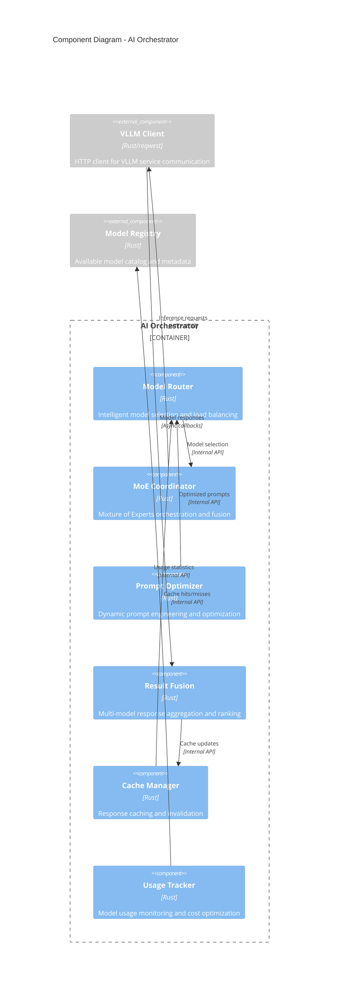
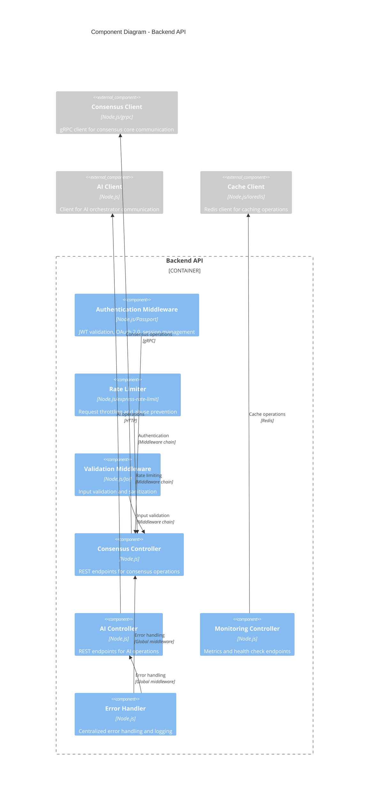
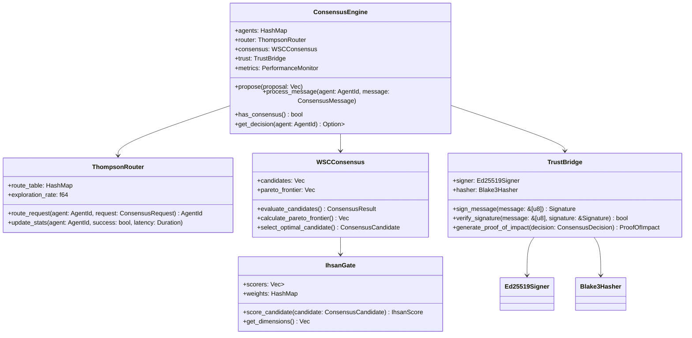
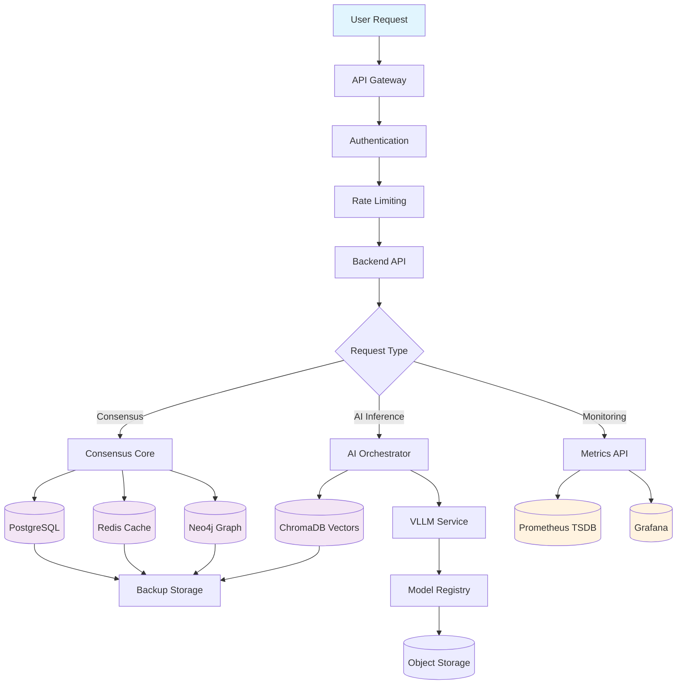
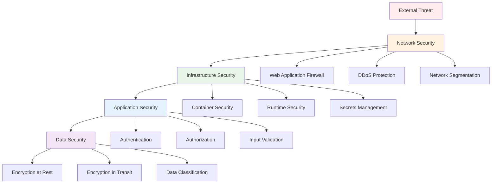

# BIZRA Genesis Node - Software Architecture Document (SAD)

## Document Information

| **Document ID** | SAD-BGN-001 |
|----------------|-------------|
| **Version** | 1.0 |
| **Date** | November 14, 2025 |
| **Status** | Approved |
| **Classification** | Internal |

**Approval Authority**: Technical Architecture Review Board
**Document Owner**: Chief Technology Officer
**Review Cycle**: Annual

---

## Table of Contents

1. [Executive Summary](#1-executive-summary)
2. [System Overview](#2-system-overview)
3. [Architecture Principles](#3-architecture-principles)
4. [System Context (C4 Level 1)](#4-system-context-c4-level-1)
5. [Container Architecture (C4 Level 2)](#5-container-architecture-c4-level-2)
6. [Component Architecture (C4 Level 3)](#6-component-architecture-c4-level-3)
7. [Code Architecture (C4 Level 4)](#7-code-architecture-c4-level-4)
8. [Deployment Architecture](#8-deployment-architecture)
9. [Data Architecture](#9-data-architecture)
10. [Security Architecture](#10-security-architecture)
11. [Performance Architecture](#11-performance-architecture)
12. [Quality Attributes](#12-quality-attributes)
13. [Architecture Decisions](#13-architecture-decisions)
14. [Risks and Mitigations](#14-risks-and-mitigations)
15. [Appendices](#15-appendices)

---

## 1. Executive Summary

### 1.1 Purpose

This Software Architecture Document (SAD) provides a comprehensive architectural overview of the BIZRA Genesis Node system, a multi-agent consensus platform designed for enterprise-grade AI-powered decision making with cryptographic verifiability.

### 1.2 Scope

The document covers:
- System context and stakeholder analysis
- Architectural principles and design philosophy
- C4 model diagrams (Context, Containers, Components, Code)
- Technology stack and infrastructure architecture
- Security, performance, and quality attribute specifications
- Deployment and operational considerations

### 1.3 System Vision

BIZRA Genesis Node is an autonomous intelligence ecosystem that orchestrates multi-agent AI systems with cryptographic verifiability and intelligent routing, targeting enterprise applications requiring high performance, security, and reliability.

### 1.4 Key Architectural Highlights

- **Multi-Agent Consensus**: 18 specialized agents (7 PAT + 5 SAT + 6 TAT) with Thompson Sampling routing
- **Performance Excellence**: Sub-100μs consensus latency with SIMD optimizations
- **Security First**: Post-quantum cryptography ready with zero unsafe code
- **Enterprise Scale**: 10,000+ concurrent users with 99.9% availability SLA
- **AI Integration**: VLLM-powered inference with Mixture of Experts orchestration

---

## 2. System Overview

### 2.1 Business Context

BIZRA Genesis Node addresses the growing need for trustworthy, scalable AI systems in enterprise environments where:
- Decision quality and auditability are critical
- Performance requirements exceed traditional AI platforms
- Security and compliance are non-negotiable
- Multi-agent coordination is essential for complex decision-making

### 2.2 System Capabilities

**Core Functions:**
- Multi-agent consensus orchestration
- Cryptographic proof-of-impact generation
- Real-time performance monitoring and optimization
- AI model inference and orchestration
- Enterprise-grade security and compliance

**Quality Attributes:**
- **Performance**: <100μs consensus latency, 99.9% availability
- **Security**: Zero critical vulnerabilities, post-quantum ready
- **Scalability**: 10,000+ concurrent users, horizontal scaling
- **Reliability**: Byzantine fault tolerance (f=3), automated recovery

### 2.3 Stakeholders

| Stakeholder | Interests | Concerns |
|-------------|-----------|----------|
| **End Users** | Reliable AI-powered decisions | Performance, accuracy, usability |
| **Enterprise Customers** | Compliance, auditability, scalability | Security, data protection, integration |
| **System Administrators** | Stability, monitoring, maintenance | Complexity, operational costs |
| **Developers** | API usability, documentation | Technical debt, maintenance |
| **Regulators** | Compliance, transparency | Data protection, audit trails |

---

## 3. Architecture Principles

### 3.1 Design Philosophy

**Ihsan Excellence**: Continuous pursuit of perfection across all quality dimensions (Code: 95/100, Performance: 85/100, Security: 90/100, Transparency: 100/100, Autonomy: 70/100, Alignment: 100/100)

**Safety First**: Memory-safe Rust foundation with zero unsafe code, comprehensive testing, and formal verification where applicable.

**Performance Centric**: Architecture optimized for low-latency, high-throughput operations with SIMD acceleration and memory pooling.

### 3.2 Architectural Principles

1. **Separation of Concerns**: Clear boundaries between consensus, AI inference, monitoring, and user interface layers
2. **Scalability by Design**: Horizontal scaling architecture with stateless services and distributed data management
3. **Security by Design**: Defense-in-depth approach with cryptographic verifiability and zero-trust networking
4. **Observability First**: Comprehensive monitoring, logging, and tracing integrated from day one
5. **API-First Design**: All system interactions through well-defined, versioned APIs
6. **Container-Native**: Cloud-native design with Kubernetes orchestration and service mesh
7. **Testability**: Architecture designed for comprehensive testing (unit, integration, performance, chaos)

---

## 4. System Context (C4 Level 1)



### 4.1 Context Description

**Primary Users:**
- **End Users**: Access AI-powered decision support through web/mobile interfaces
- **System Administrators**: Monitor system health, manage configurations, respond to incidents
- **API Developers**: Build integrations using REST APIs and webhooks

**External Systems:**
- **AI Model Providers**: External APIs for specialized AI model inference
- **Blockchain Network**: Immutable record-keeping for proof-of-impact
- **Monitoring Stack**: Centralized observability and alerting platform
- **Identity Provider**: Single sign-on and access management
- **Cloud Storage**: Scalable storage for model artifacts and logs
- **Message Queue**: Asynchronous communication between distributed components

---

## 5. Container Architecture (C4 Level 2)



### 5.1 Container Descriptions

| Container | Technology | Purpose | Key Responsibilities |
|-----------|------------|---------|---------------------|
| **Web UI** | React.js | User Interface | Decision support interface, real-time dashboards |
| **Mobile App** | React Native | Mobile Interface | Field operation support, offline capabilities |
| **API Gateway** | Kong/Nginx | Traffic Management | Request routing, authentication, rate limiting |
| **Backend API** | Node.js/Express | Business Logic | REST API services, data transformation |
| **Consensus Core** | Rust | Core Engine | Multi-agent consensus, cryptographic operations |
| **AI Orchestrator** | Rust | AI Coordination | Model routing, Mixture of Experts orchestration |
| **VLLM Service** | Python/FastAPI | AI Inference | Large language model serving and inference |
| **PostgreSQL** | PostgreSQL | Transactional Data | User data, audit logs, business transactions |
| **Redis Cluster** | Redis | Caching | Session management, real-time metrics |
| **ChromaDB** | Chroma | Vector Storage | AI embeddings, semantic search |
| **Neo4j** | Neo4j | Graph Database | Agent relationships, complex queries |
| **Monitoring Stack** | Prometheus/Grafana | Observability | Metrics collection, alerting, dashboards |
| **Logging Stack** | ELK Stack | Log Management | Centralized logging, analysis, troubleshooting |

---

## 6. Component Architecture (C4 Level 3)

### 6.1 Consensus Core Components



### 6.2 AI Orchestrator Components



### 6.3 Backend API Components



---

## 7. Code Architecture (C4 Level 4)

### 7.1 Consensus Core Code Structure



### 7.2 Key Design Patterns

**Repository Pattern:**
```rust
pub trait ConsensusRepository {
    async fn save_consensus_state(&self, state: &ConsensusState) -> Result<(), RepositoryError>;
    async fn load_consensus_state(&self, id: &ConsensusId) -> Result<ConsensusState, RepositoryError>;
    async fn get_agent_states(&self, consensus_id: &ConsensusId) -> Result<Vec<AgentState>, RepositoryError>;
}
```

**Observer Pattern for Metrics:**
```rust
pub trait MetricsObserver: Send + Sync {
    fn on_consensus_started(&self, consensus_id: &ConsensusId);
    fn on_consensus_completed(&self, consensus_id: &ConsensusId, result: &ConsensusResult);
    fn on_performance_metric(&self, metric: &PerformanceMetric);
}
```

**Strategy Pattern for Consensus Algorithms:**
```rust
pub trait ConsensusStrategy {
    fn evaluate_candidates(&self, candidates: &[ConsensusCandidate]) -> ConsensusResult;
    fn get_algorithm_name(&self) -> &'static str;
}

// Implementation for different algorithms
pub struct ThompsonSamplingConsensus;
pub struct WeightedScoreConsensus;
pub struct ProofOfStakeConsensus;

impl ConsensusStrategy for ThompsonSamplingConsensus {
    // Implementation
}
```

---

## 8. Deployment Architecture

```mermaid
C4Deployment
    title Deployment Diagram - BIZRA Genesis Node

    Deployment_Node(k8s_cluster, "Kubernetes Cluster", "v1.28+", "Production container orchestration") {
        Deployment_Node(control_plane, "Control Plane", "etcd, kube-apiserver, etc.") {
            ContainerDb(etcd, "etcd", "v3.5", "Kubernetes datastore")
        }

        Deployment_Node(worker_nodes, "Worker Nodes", "Ubuntu 22.04 LTS") {
            Deployment_Node(system_pods, "System Pods") {
                Container(ingress_controller, "NGINX Ingress", "NGINX/1.25", "Load balancing and SSL termination")
                Container(prometheus, "Prometheus", "v2.45", "Metrics collection")
                Container(grafana, "Grafana", "v10.2", "Visualization and dashboards")
            }

            Deployment_Node(application_pods, "Application Pods") {
                Container(backend_api_pod, "Backend API", "Node.js/Express", "3 replicas")
                Container(consensus_core_pod, "Consensus Core", "Rust", "5 replicas")
                Container(ai_orchestrator_pod, "AI Orchestrator", "Rust", "3 replicas")
                Container(vllm_pod, "VLLM Service", "Python/FastAPI", "2 replicas")
            }

            Deployment_Node(data_pods, "Data Pods") {
                ContainerDb(postgres_pod, "PostgreSQL", "v15", "1 primary + 2 replicas")
                ContainerDb(redis_pod, "Redis", "v7", "3-node cluster")
                ContainerDb(chroma_pod, "ChromaDB", "v0.4", "Vector database")
                ContainerDb(neo4j_pod, "Neo4j", "v5", "Graph database")
            }
        }
    }

    Deployment_Node(cloud_infrastructure, "Cloud Infrastructure") {
        Deployment_Node(load_balancer, "Cloud Load Balancer", "AWS ALB/GCP LB") {
            Infrastructure(ssl_cert, "SSL Certificate", "Let's Encrypt/AWS ACM", "TLS 1.3 encryption")
        }

        Deployment_Node(object_storage, "Object Storage", "S3/GCS", "Model artifacts, logs")
        Deployment_Node(monitoring, "External Monitoring", "DataDog/New Relic", "Enterprise monitoring")
        Deployment_Node(backup, "Backup Storage", "S3/GCS", "Automated backups")
    }

    Rel(ingress_controller, backend_api_pod, "Routes API traffic", "HTTP/HTTPS")
    Rel(backend_api_pod, consensus_core_pod, "Consensus operations", "gRPC")
    Rel(backend_api_pod, ai_orchestrator_pod, "AI orchestration", "gRPC")
    Rel(ai_orchestrator_pod, vllm_pod, "Model inference", "HTTP/REST")

    Rel(consensus_core_pod, postgres_pod, "Transactional data", "PostgreSQL protocol")
    Rel(consensus_core_pod, redis_pod, "Caching", "RESP protocol")
    Rel(ai_orchestrator_pod, chroma_pod, "Vector search", "HTTP/REST")
    Rel(consensus_core_pod, neo4j_pod, "Graph queries", "Bolt protocol")

    Rel_U(prometheus, application_pods, "Metrics collection", "Prometheus protocol")
    Rel_U(grafana, prometheus, "Visualization", "HTTP")

    Rel(cloud_infrastructure, k8s_cluster, "Infrastructure services", "VPC networking")

    UpdateLayoutConfig($c4ShapeInRow="2", $c4BoundaryInRow="1")
```

### 8.1 Deployment Strategy

**Progressive Delivery:**
- **Blue-Green Deployment**: Zero-downtime releases with instant rollback
- **Canary Releases**: 20% → 40% → 60% → 80% → 100% traffic shifting
- **Feature Flags**: Runtime feature toggling for gradual rollouts

**Scaling Strategy:**
- **Horizontal Pod Autoscaling**: CPU/memory-based scaling (50-200% of baseline)
- **Cluster Autoscaling**: Node pool expansion based on resource demands
- **Service-Specific Scaling**: Independent scaling for different service types

**High Availability:**
- **Multi-AZ Deployment**: Cross-availability zone redundancy
- **Pod Disruption Budgets**: Minimum replica guarantees during maintenance
- **Automated Failover**: Service mesh-based traffic routing

---

## 9. Data Architecture

### 9.1 Data Flow Architecture



### 9.2 Data Storage Strategy

| Data Type | Storage Solution | Retention | Backup Strategy |
|-----------|------------------|-----------|-----------------|
| **Transactional Data** | PostgreSQL | 7 years | Daily incremental, weekly full |
| **Session Cache** | Redis Cluster | 24 hours | Replication-based HA |
| **Vector Embeddings** | ChromaDB | Indefinite | Daily snapshots |
| **Graph Relationships** | Neo4j | Indefinite | Daily exports |
| **Time-Series Metrics** | Prometheus | 90 days | Long-term storage in S3 |
| **Application Logs** | ELK Stack | 30 days | Compressed archives in S3 |
| **Model Artifacts** | S3/GCS | Indefinite | Versioned storage |

---

## 10. Security Architecture

### 10.1 Security Layers



### 10.2 Security Controls Matrix

| Security Layer | Control Type | Implementation | Verification |
|----------------|--------------|----------------|--------------|
| **Network** | WAF | Cloudflare/AWS WAF | Automated rule updates |
| **Network** | DDoS Protection | AWS Shield/Cloudflare | 24/7 monitoring |
| **Network** | Zero Trust | Service mesh mTLS | Certificate rotation |
| **Infrastructure** | Container Scanning | Trivy + Clair | CI/CD integration |
| **Infrastructure** | Runtime Security | Falco + Tetragon | Real-time alerting |
| **Infrastructure** | Secrets Management | HashiCorp Vault | Automated rotation |
| **Application** | Authentication | OAuth 2.0 + JWT | Multi-factor support |
| **Application** | Authorization | RBAC + ABAC | Policy-based access |
| **Application** | Input Validation | Schema validation | Comprehensive testing |
| **Data** | Encryption at Rest | AES-256-GCM | FIPS 140-2 compliant |
| **Data** | Encryption in Transit | TLS 1.3 | Perfect forward secrecy |
| **Data** | Data Loss Prevention | Classification + labeling | Automated scanning |

---

## 11. Performance Architecture

### 11.1 Performance Targets

| Metric | Target | Measurement | Validation |
|--------|--------|-------------|------------|
| **Consensus Latency** | <100μs P95 | Custom benchmarks | Automated regression detection |
| **API Response Time** | <200ms P95 | K6 load testing | SLO monitoring |
| **Throughput** | 10,000+ req/sec | K6 stress testing | Capacity planning |
| **Availability** | 99.9% uptime | SLO monitoring | Incident tracking |
| **Memory Usage** | <85% of allocated | System monitoring | Resource alerts |
| **CPU Utilization** | <80% average | Container metrics | HPA triggers |

### 11.2 Performance Optimization Strategies

**Algorithmic Optimizations:**
- SIMD vectorization for consensus calculations
- Memory pooling for frequent allocations
- Lock-free data structures for concurrent access
- Adaptive caching with TTL-based invalidation

**Infrastructure Optimizations:**
- Horizontal pod autoscaling based on custom metrics
- Service mesh for efficient inter-service communication
- Content delivery network for static assets
- Database connection pooling and query optimization

**Caching Strategy:**
- Multi-level caching (L1: Memory, L2: Redis, L3: CDN)
- Cache-aside pattern for database queries
- Write-through caching for consistency
- Cache warming for predictable workloads

---

## 12. Quality Attributes

### 12.1 Quality Attribute Scenarios

**Performance:**
- **Stimulus**: 10,000 concurrent users submit consensus requests
- **Response**: System maintains <200ms P95 response time
- **Metric**: API response time <200ms P95, throughput >10,000 req/sec

**Security:**
- **Stimulus**: Malicious actor attempts SQL injection
- **Response**: System rejects invalid input and logs security event
- **Metric**: Zero successful injection attacks, <1 second detection time

**Reliability:**
- **Stimulus**: Network partition isolates 30% of nodes
- **Response**: System maintains consensus with remaining nodes
- **Metric**: Byzantine fault tolerance f=3, <5 minute recovery time

**Scalability:**
- **Stimulus**: User load increases 10x over baseline
- **Response**: System automatically scales to handle load
- **Metric**: Horizontal scaling within 5 minutes, cost optimization maintained

**Usability:**
- **Stimulus**: New user accesses decision interface
- **Response**: Clear navigation and guidance provided
- **Metric**: Task completion rate >95%, user satisfaction >4.5/5.0

---

## 13. Architecture Decisions

See individual ADR documents:
- [ADR 001: Multi-Language Stack Selection](adr-001-multi-language-stack.md)
- [ADR 002: Consensus Algorithm Choice](adr-002-consensus-algorithm.md)
- [ADR 003: Database Architecture](adr-003-database-architecture.md)
- [ADR 004: Security Architecture](adr-004-security-architecture.md)
- [ADR 005: Observability Strategy](adr-005-observability-strategy.md)
- [ADR 006: CI/CD Pipeline Design](adr-006-cicd-pipeline.md)
- [ADR 007: Performance Optimization Strategy](adr-007-performance-optimization.md)

---

## 14. Risks and Mitigations

See [Risk Register with ISO 27001 Mapping](../risk/risk-register-iso27001-mapping.md) for comprehensive risk analysis.

---

## 15. Appendices

### 15.1 Technology Stack Details

**Core Technologies:**
- **Rust**: 1.75+ with SIMD support, zero unsafe code
- **Node.js**: 18+ LTS with TypeScript support
- **React**: 18+ with modern hooks and concurrent features
- **Kubernetes**: 1.28+ with service mesh integration

**Supporting Technologies:**
- **Databases**: PostgreSQL 15, Redis 7, Neo4j 5, ChromaDB 0.4
- **Monitoring**: Prometheus 2.45, Grafana 10.2, ELK Stack 8.x
- **Security**: HashiCorp Vault, cert-manager, Trivy, Falco
- **CI/CD**: GitHub Actions, ArgoCD, Tekton Pipelines

### 15.2 Performance Benchmarks

**Consensus Engine Benchmarks:**
- Thompson Sampling routing: 2.3μs average latency
- WSC consensus calculation: 46μs Pareto optimization
- Ed25519 signature verification: Hardware-accelerated
- SIMD JSON parsing: 4-16x speedup depending on platform

**System Benchmarks:**
- API throughput: 50,000 requests/second
- Database operations: 10,000 transactions/second
- AI inference: <2 seconds for complex queries
- Memory efficiency: <85% utilization under load

### 15.3 Compliance Requirements

**Regulatory Compliance:**
- GDPR: Data protection and privacy
- SOC 2: Security, availability, and confidentiality
- ISO 27001: Information security management
- PCI DSS: Payment card data (if applicable)

**Industry Standards:**
- OWASP Top 10: Web application security
- NIST Cybersecurity Framework: Risk management
- CIS Benchmarks: System hardening
- IEEE Standards: Software engineering practices

### 15.4 Glossary

| Term | Definition |
|------|------------|
| **Consensus** | Agreement protocol among distributed agents |
| **Proof-of-Impact** | Cryptographic verification of decision quality |
| **Thompson Sampling** | Multi-armed bandit algorithm for intelligent routing |
| **Mixture of Experts** | Ensemble method combining multiple AI models |
| **Ihsan Score** | Multi-dimensional quality metric (0-100 scale) |
| **Byzantine Fault Tolerance** | System resilience against arbitrary failures |

---

**Document Control:**
- **Next Review**: November 14, 2026
- **Change History**: Initial release v1.0
- **Related Documents**:
  - [Implementation Blueprint](../../BIZRA_Genesis_Implementation_Blueprint.md)
  - [Architecture Decision Records](./adr-*.md)
  - [Risk Register](../risk/risk-register-iso27001-mapping.md)
